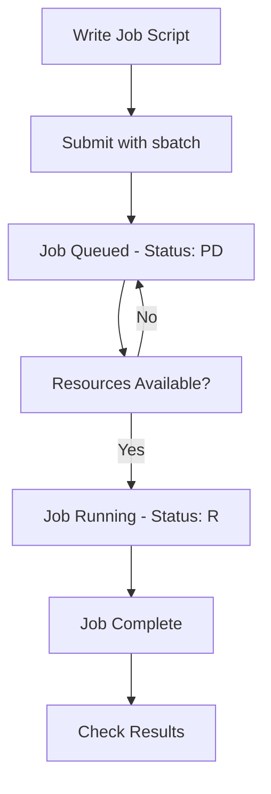

# 🖥️ SLURM Guide

A simple guide to using SLURM (Simple Linux Utility for Resource Management) on KFUPM clusters.

---

##  Current Cluster Setup
### 📊 Partition Details
| Partition | Purpose | Time Limit | Nodes | GPUs |
|-----------|---------|------------|-------|------|
| **Normal*** | Large Models| 24 hours | server02 | 6x A100 |
| **RTX3090** | GPU computing | 24 hours | jrcai01-02 | 2x (2xRTX 3090) |
| **LoginNode** | Access only | - | jrcai23 | Login access |

*\* Default partition*

### 👥 Group Management
- **Advisor Groups**: Each advisor has a group with their students
- **Shared Storage**: Groups share disk space within their allocation
- **Job Limits**: 
  - **Normal Partition**: 1 job limit per group (default)
  - **RTX3090 Partition**: Groups can submit 1 additional GPU job by specifying this partition

## 📖 Documentation

###  🔗 [How to Connect](How_to_Connect.md)
Learn how to connect to the SLURM cluster using:
- SSH Terminal
- Visual Studio Code

###  ⚡ [How to Use SLURM](How_to_Use.md)
Complete guide covering:
- Monitoring commands 
- Job submission 
- Data transfer 
- Account management 
---

## 📋 Basic SLURM Workflow

---
###  Getting Help

#### **Contact Information:**
- **System Administrator**: Contact JRCAI support team
- **Technical Issues**: mohammed.sinan@kfupm.edu.sa
- **Account Problems**: Submit ticket through proper channels

*Last Updated: 16/9/2025*  
*By: Mohammed AlSinan (mohammed.sinan@kfupm.edu.sa)*

**Login Node**: (check your email/registration details)

