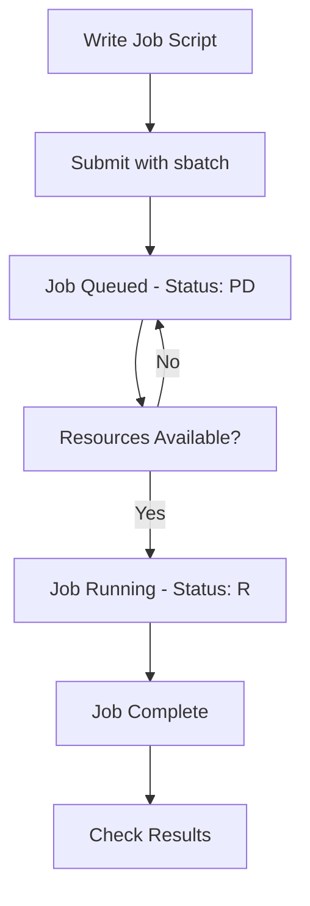

# 🖥️ SLURM Guide

A simple guide to using SLURM (Simple Linux Utility for Resource Management) on KFUPM clusters.

---

## 📖 Documentation

### 1. 🔗 [How to Connect](How_to_Connect.md)
Learn how to connect to the SLURM cluster using:
- SSH Terminal
- Visual Studio Code

### 2. ⚡ [How to Use SLURM](How_to_Use.md)
Complete guide covering:
- Monitoring commands 
- Job submission 
- Data transfer 
- Account management 
---

## 📋 Basic SLURM Workflow

---

###  Getting Help

#### **Contact Information:**
- **System Administrator**: Contact JRCAI support team
- **Technical Issues**: mohammed.sinan@kfupm.edu.sa
- **Account Problems**: Submit ticket through proper channels

*Last Updated: 16/9/2025*  
*By: Mohammed AlSinan (mohammed.sinan@kfupm.edu.sa)*

**Login Node**: (check your email/registration details)

