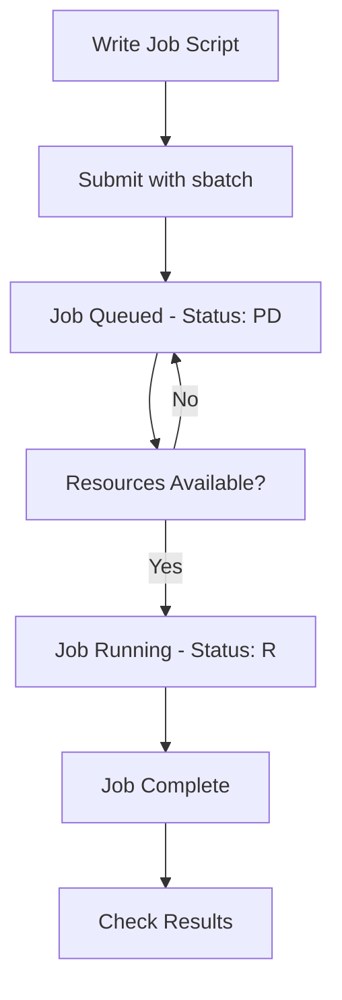

# 🖥️ SLURM Guide

A simple guide to using SLURM (Simple Linux Utility for Resource Management) on KFUPM clusters.

---

##  Current Cluster Setup
### 📊 Partition Details
| Partition | Purpose | Time Limit | Nodes | GPUs |
|-----------|---------|------------|-------|------|
| **A100** | Large Models| 24 hours | server02 | 6x A100 |
| **RTX3090*** | GPU computing | 24 hours | jrcai[01-02,08] | 2x (2xRTX 3090),1x(3xRTX 3090) |
| **A6000** | GPU computing | 24 hours | jrcai[18],server01 | 1x(2xA6000) 1x(8xA6000) |
| **LoginNode** | Access only | - | jrcai23 | Login access |

*\* Default partition*

### Available Nodes and Their Resources

| Node | GPUs | GPU Type | VRAM | CPUs | Memory |
|------|------|----------|------|------|--------|
| server02 | 6 | A100 | 80GB | 255 | ~2TB |
| server02 | 8 | A6000 | 49GB | 64 | ~1TB |
| jrcai18 | 2 | A6000 | 48GB | 32 | ~256GB |
| jrcai01 | 2 | RTX 3090 | 24GB | 48 | ~64GB |
| jrcai02 | 2 | RTX 3090 | 24GB | 48 | ~64GB |
| jrcai08 | 3 | RTX 3090 | 24GB | 64 | ~256GB |

### 👥 Group Management
- **Advisor Groups**: Each advisor has a group with their students
- **Shared Storage**: Groups are hard-limited to 1 TB of shared disk space.
- **Job Limits**: 
  - **A100 Partition**: 1 job limit per group
  - **RTX3090 Partition (Default)**: Groups can submit 1 additional GPU job by specifying this partition
  - **A6000 Partition**: Groups can submit 1 additional GPU job by specifying this partition

## 📖 Documentation

###  🔗 [How to Connect](How_to_Connect.md)
Learn how to connect to the SLURM cluster using:
- SSH Terminal
- Visual Studio Code

###  ⚡ [How to Use SLURM](How_to_Use.md)
Complete guide covering:
- Monitoring commands 
- Job submission 
- Data transfer 
- Account management 
---

## 📋 Basic SLURM Workflow

---
###  Getting Help

#### **Contact Information:**
- **System Administrator**: Contact JRCAI support team
- **Technical Issues**: mohammed.sinan@kfupm.edu.sa
- **Account Problems**: Submit ticket through proper channels

*Last Updated: 16/9/2025*  
*By: Mohammed AlSinan (mohammed.sinan@kfupm.edu.sa)*

**Login Node**: (check your email/registration details)

