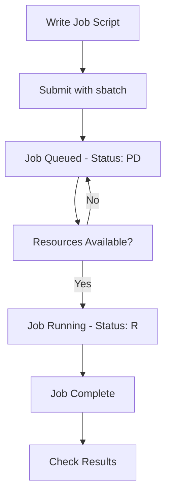

# 🖥️ SLURM Guide

A simple guide to using SLURM (Simple Linux Utility for Resource Management) on KFUPM clusters.

---

##  Current Cluster Setup
### 📊 Partition Details
| Partition | Purpose | Default / Max Time | Nodes | GPUs |
|-----------|---------|--------------------|-------|------|
| **A100** | Large models | 16 h / 2 days | server02 | 6× A100 (80 GB) |
| **RTX3090** (Default) | GPU computing | 16 h / 2 days | jrcai[01-02,06-10] | 19× RTX 3090 (24 GB) |
| **A6000** | GPU computing | 16 h / 2 days | jrcai[17-19], server01 | 14× A6000 (48 GB) |
| **A5000** | GPU computing | 16 h / 2 days | jrcai[12-13] | 8× A5000 (24 GB) |
| **A4500** | GPU computing | 16 h / 2 days | jrcai[14-16,21] | 8× RTX A4500 (20 GB) |
| **interactive** | Short interactive sessions | 2 h / 2 h | all compute nodes | any available |
| **LoginNode** | Access only | - | login01 | Login access |

> [!NOTE]
> If you don't specify a partition, your job runs on **RTX3090** (the default). Jobs get a **16 h** time limit if you don't request one, up to a **2-day** maximum.

> [!WARNING]
> Login nodes (login01) are for access only and should not be used to run scripts or computational workloads.

### Available Nodes and Their Resources

| Node | Partition | GPUs | GPU Type | VRAM | CPUs | Memory |
|------|-----------|------|----------|------|------|--------|
| server02 | A100 | 6 | A100 | 80 GB | 255 | ~2 TB |
| server01 | A6000 | 8 | A6000 | 48 GB | 64 | ~1 TB |
| jrcai17 \* | A6000 | 2 | A6000 | 48 GB | 28 | ~256 GB |
| jrcai18 | A6000 | 2 | A6000 | 48 GB | 32 | ~256 GB |
| jrcai19 | A6000 | 2 | A6000 | 48 GB | 32 | ~256 GB |
| jrcai01 | RTX3090 | 2 | RTX 3090 | 24 GB | 48 | ~64 GB |
| jrcai02 | RTX3090 | 2 | RTX 3090 | 24 GB | 48 | ~64 GB |
| jrcai06 | RTX3090 | 3 | RTX 3090 | 24 GB | 64 | ~256 GB |
| jrcai07 | RTX3090 | 3 | RTX 3090 | 24 GB | 64 | ~256 GB |
| jrcai08 | RTX3090 | 3 | RTX 3090 | 24 GB | 64 | ~256 GB |
| jrcai09 | RTX3090 | 3 | RTX 3090 | 24 GB | 64 | ~256 GB |
| jrcai10 | RTX3090 | 3 | RTX 3090 | 24 GB | 64 | ~256 GB |
| jrcai12 | A5000 | 4 | A5000 | 24 GB | 64 | ~256 GB |
| jrcai13 | A5000 | 4 | A5000 | 24 GB | 64 | ~256 GB |
| jrcai14 | A4500 | 2 | RTX A4500 | 20 GB | 32 | ~256 GB |
| jrcai15 | A4500 | 2 | RTX A4500 | 20 GB | 32 | ~256 GB |
| jrcai16 | A4500 | 2 | RTX A4500 | 20 GB | 20 | ~128 GB |
| jrcai21 | A4500 | 2 | RTX A4500 | 20 GB | 20 | ~128 GB |

\* jrcai17 is configured but not yet in service (`State=FUTURE`).

**Total: ~55 GPUs across 18 compute nodes.**

### 👥 Group Management
- **Advisor Groups**: Each advisor has a group with their students
- **Shared Storage**: Each group has a shared directory at `/SLURM/group/<groupName>`, hard-limited to 4 TB of disk space.
- **Job Limits** — *cluster-wide, GPU-based (updated policy):*
  - Up to **6 GPUs' worth of concurrent running jobs per group**, across the entire cluster (previously: one job per partition).
  - **A100 partition**: given its high demand, max **2 jobs per group** and **1 job per user** at any time.
### Model Zoo
Our model zoo contains 90+ models sourced from HuggingFace, including Arabic-specialized models and multilingual LLMs.

[Model Zoo](model_zoo.md)

## 📖 Documentation

###  🔗 [How to Connect](How_to_Connect.md)
Learn how to connect to the SLURM cluster using:
- SSH Terminal
- Visual Studio Code

###  ⚡ [How to Use SLURM](How_to_Use.md)
Complete guide covering:
- Monitoring commands 
- Job submission 
- Data transfer 
- Account management 
---

## 📋 Basic SLURM Workflow

```mermaid
graph TD
    A[Write Job Script] --> B[Submit with sbatch]
    B --> C[Job Queued - Status: PD]
    C --> D[Resources Available?]
    D -->|No| C
    D -->|Yes| E[Job Running - Status: R]
    E --> F[Job Complete]
    F --> G[Check Results]
```

---
###  Getting Help

#### **Contact Information:**
- **System Administrator**: Contact JRCAI support team
- **Technical Issues**: mohammed.sinan@kfupm.edu.sa
- **Account Problems**: Submit ticket through proper channels

*Last Updated: 6/9/2026*  
*By: Mohammed AlSinan (mohammed.sinan@kfupm.edu.sa)*

**Login Node**: (check your email/registration details)

