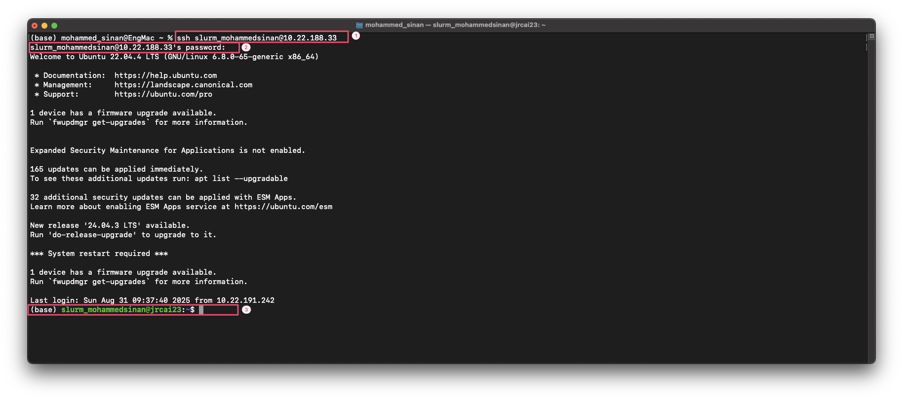
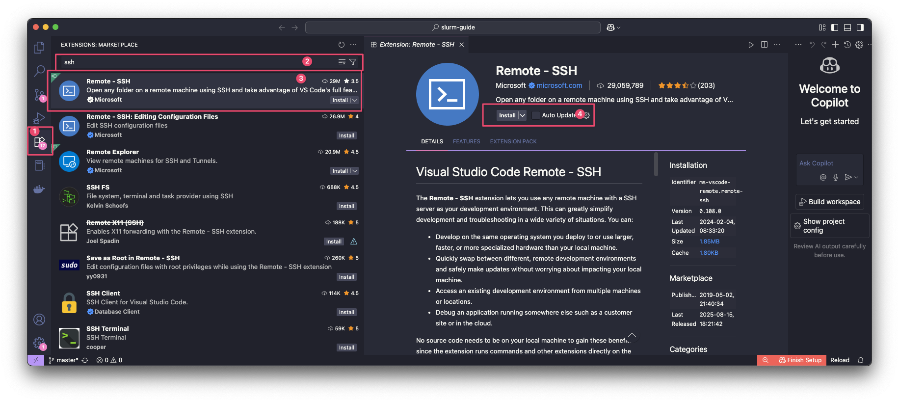
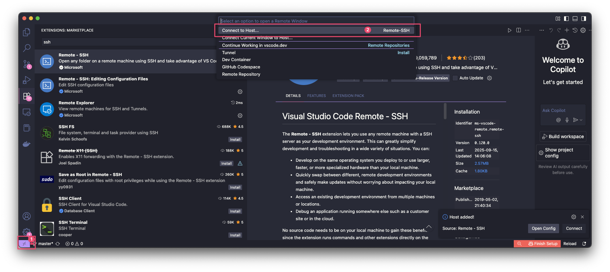
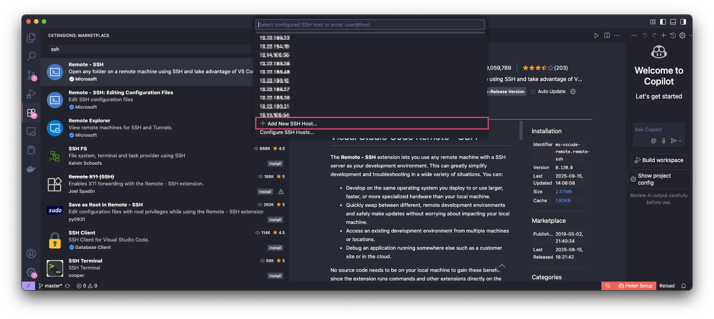
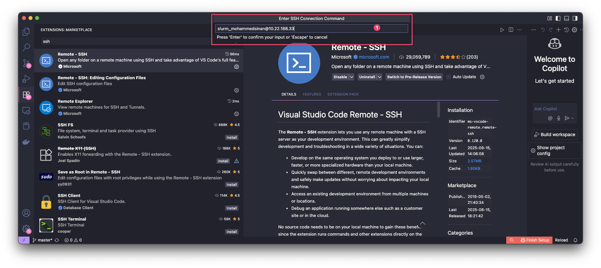
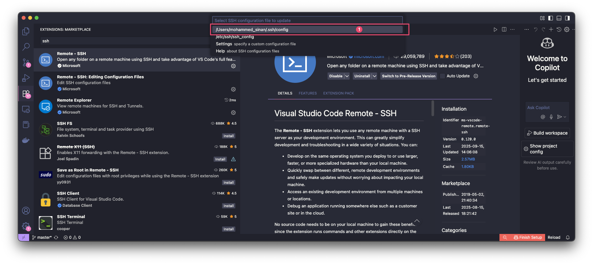
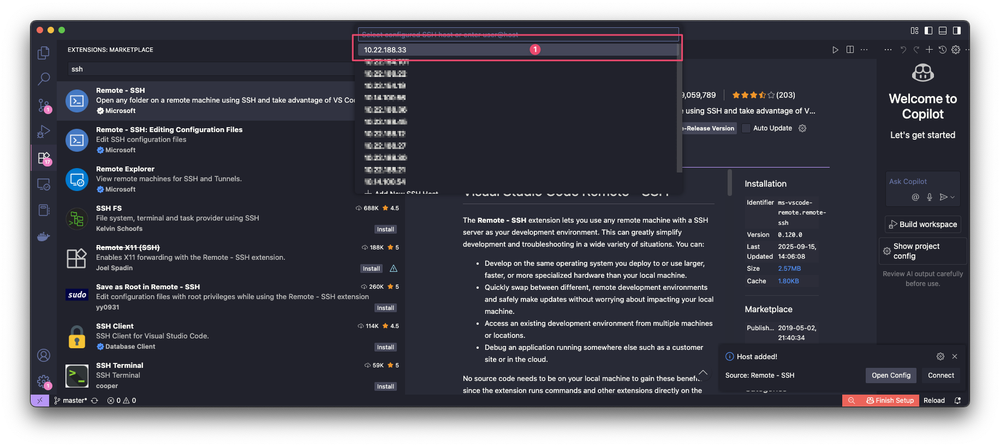
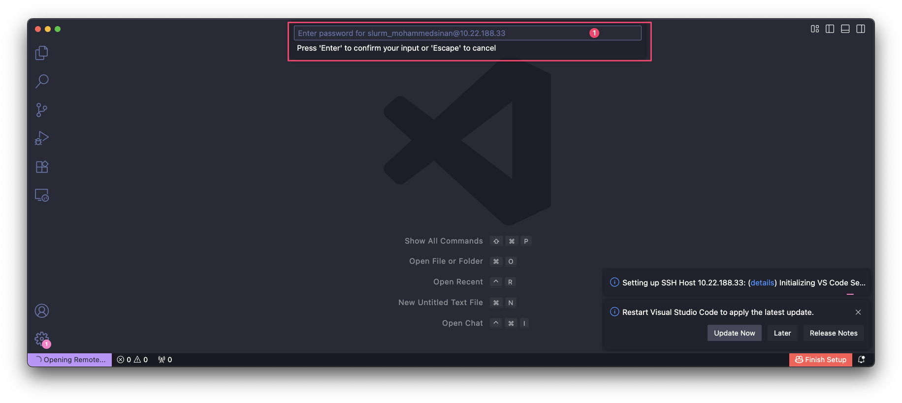
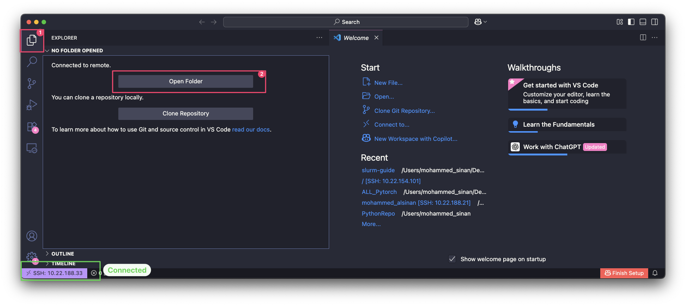
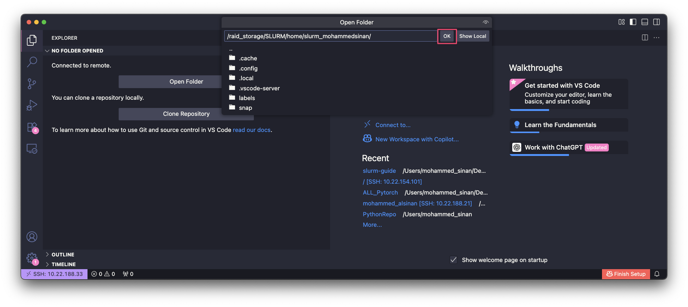

# How to Connect

Slurm (Simple Linux Utility for Resource Management) is a workload manager designed for clusters. It efficiently schedules jobs and manages resources, ensuring fair and effective utilization of computational power.

To use SLURM, you need to connect to the login node of the cluster. Pick whichever method fits your workflow:

=== "Terminal"

    For all operating systems, the command to connect via terminal is the same:

    ```bash title="Connect over SSH"
    ssh <username>@<login-node>
    ```

    **Example connection process:**

    

=== "Visual Studio Code"

    If you have VS Code installed, use the Remote-SSH extension to connect to the login node.

    [Download VS Code :material-download:](https://code.visualstudio.com/download){ .md-button }

    1.  **Install the Remote-SSH extension**

        

    2.  **Open the Remote Window menu**

        

    3.  **Add a new SSH host**

        

    4.  **Enter the connection details**, `<username>@<login-node>`

        

    5.  **Select the SSH config file** to save the host to

        

    6.  **Open the Remote Window menu again** and connect to the host

        

    7.  **Select your host** from the list

        

    8.  **Authenticate** with your password

        

    9.  **Open your home directory**

        
        

!!! warning

    Login nodes are for access only and should not be used to run scripts or computational workloads. Submit jobs with `sbatch`/`salloc` instead — see [Using SLURM](using-slurm/index.md).
