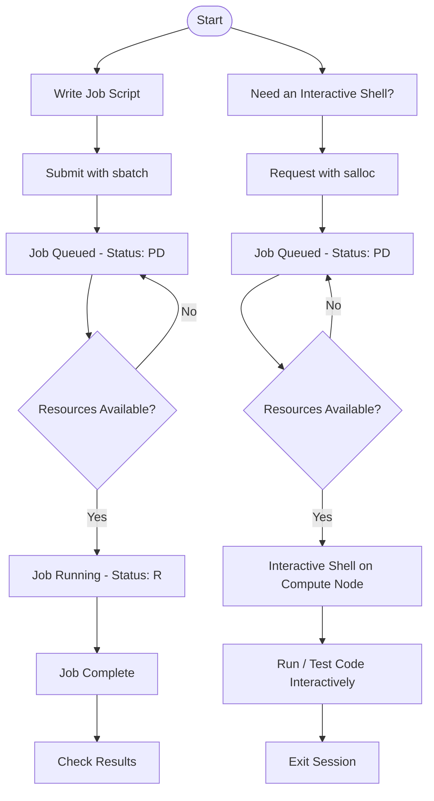

# SLURM Guide — KFUPM JRCAI

Slurm (Simple Linux Utility for Resource Management) is a workload manager designed for clusters. It efficiently schedules jobs and manages resources, ensuring fair and effective utilization of computational power. This guide covers how to connect to and use SLURM on KFUPM JRCAI clusters.

[:octicons-arrow-right-24: How to Connect](how-to-connect.md){ .md-button .md-button--primary }
[View on GitHub :fontawesome-brands-github:](https://github.com/KFUPM-JRCAI/slurm-users-guide){ .md-button }

## Documentation

-   :material-server-network:{ .lg .middle } **Cluster Resources**

    ---

    Partitions, nodes, GPUs, and per-group job limits at a glance.

    [:octicons-arrow-right-24: Read more](cluster-resources.md)

-   :material-account-group:{ .lg .middle } **Group Policies**

    ---

    Storage quotas, job limits, and best practices for using the cluster responsibly.

    [:octicons-arrow-right-24: Read more](group-policies.md)

-   :material-connection:{ .lg .middle } **How to Connect**

    ---

    Reach the login node over SSH or Visual Studio Code Remote-SSH.

    [:octicons-arrow-right-24: Read more](how-to-connect.md)

-   :material-rocket-launch-outline:{ .lg .middle } **Using SLURM**

    ---

    Monitor the cluster, submit and manage jobs, move data, and manage your account.

    [:octicons-arrow-right-24: Read more](using-slurm/index.md)

-   :material-file-code-outline:{ .lg .middle } **Job Script Templates**

    ---

    Ready-to-copy `sbatch` templates for CPU and GPU jobs.

    [:octicons-arrow-right-24: Read more](job-script-templates.md)

-   :material-notebook-outline:{ .lg .middle } **Jupyter Access**

    ---

    Run Jupyter Notebook/Lab on a compute node, directly or through VS Code.

    [:octicons-arrow-right-24: Read more](jupyter-access.md)

-   :material-harddisk:{ .lg .middle } **Storage**

    ---

    Home vs. group directories, quotas, and the shared `~/guide` examples folder.

    [:octicons-arrow-right-24: Read more](storage.md)

-   :material-help-circle-outline:{ .lg .middle } **FAQ & Troubleshooting**

    ---

    Common errors and what to do about them.

    [:octicons-arrow-right-24: Read more](faq.md)

-   :material-cog-outline:{ .lg .middle } **Environment**

    ---

    Shell settings, modules, the package cache, and the Model Zoo.

    [:octicons-arrow-right-24: Read more](environment/index.md)

-   :material-database-search-outline:{ .lg .middle } **Model Zoo**

    ---

    90+ ready-to-use HuggingFace models, including Arabic-specialized and multilingual LLMs.

    [:octicons-arrow-right-24: Read more](model-zoo/index.md)

-   :material-chat-processing-outline:{ .lg .middle } **Ollama**

    ---

    Run LLMs on a GPU with one command, inside your own job.

    [:octicons-arrow-right-24: Read more](software/ollama.md)

-   :material-cube-outline:{ .lg .middle } **Apptainer**

    ---

    Run Docker/container images on the cluster without admin rights.

    [:octicons-arrow-right-24: Read more](software/apptainer.md)

## Basic SLURM Workflow

## Getting Help

**Contact Information:**

- **System Administrator**: Contact JRCAI support team
- **Technical Issues**: mohammed.sinan@kfupm.edu.sa
- **Account Problems**: Submit ticket through proper channels

**Login node address**: sent with your account details.

---

*Last updated 10/1/2026 by Mohammed AlSinan (mohammed.sinan@kfupm.edu.sa)*
