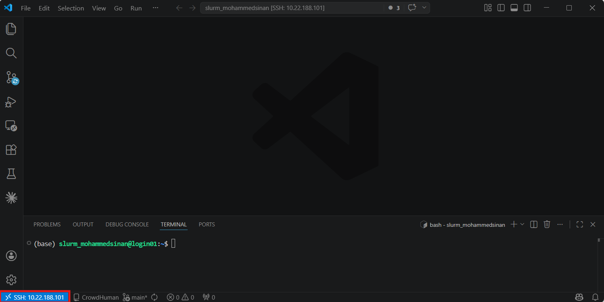
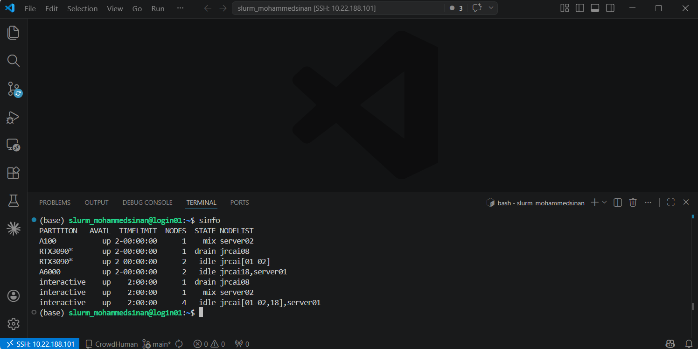
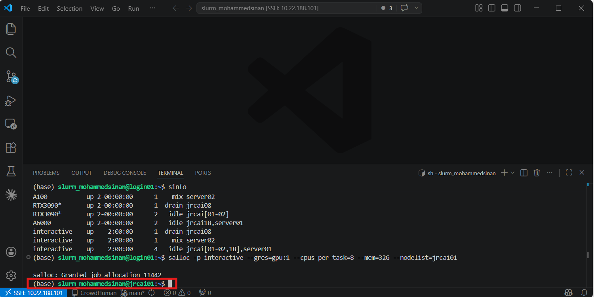
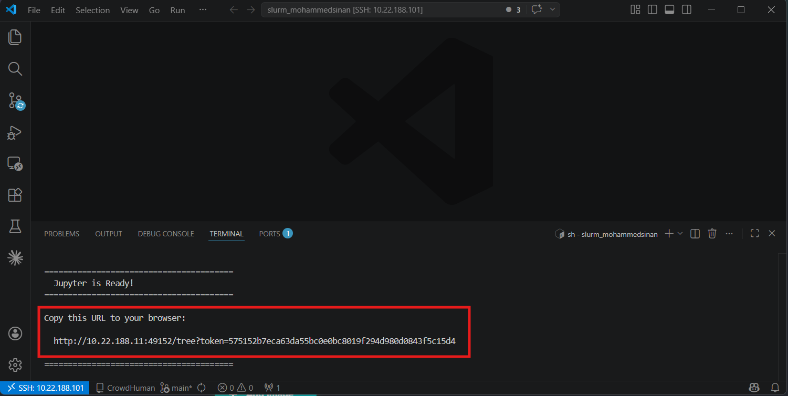
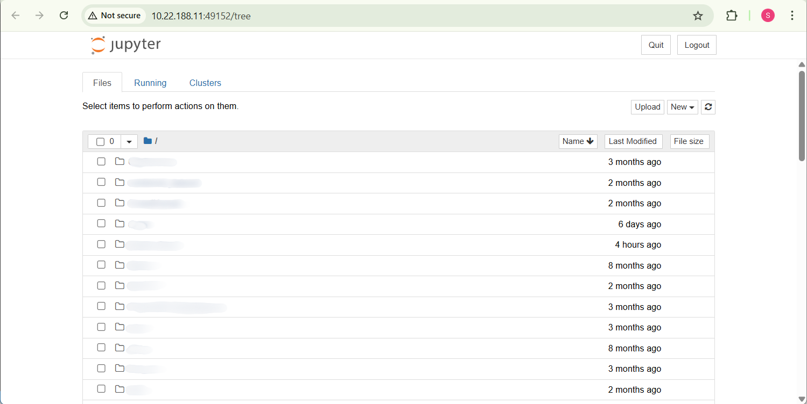
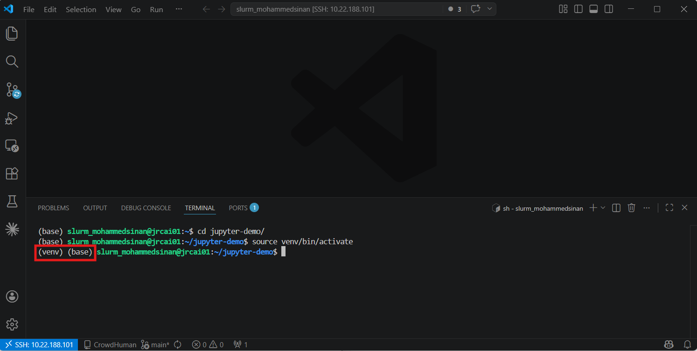
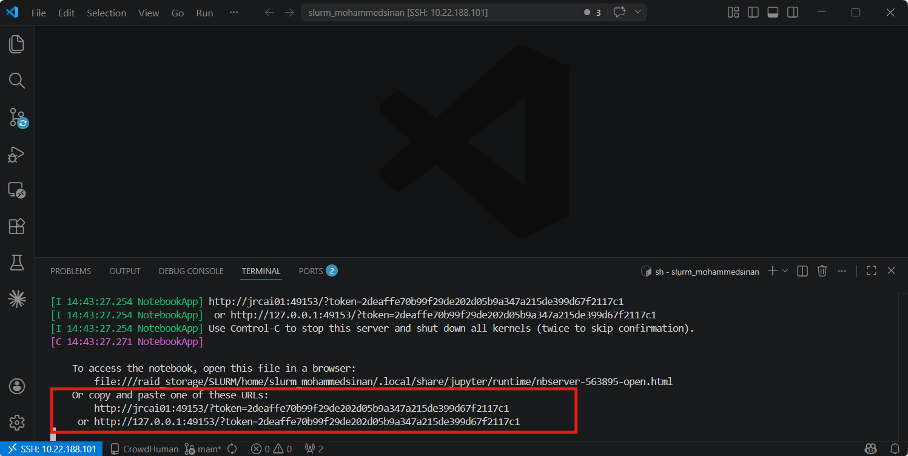
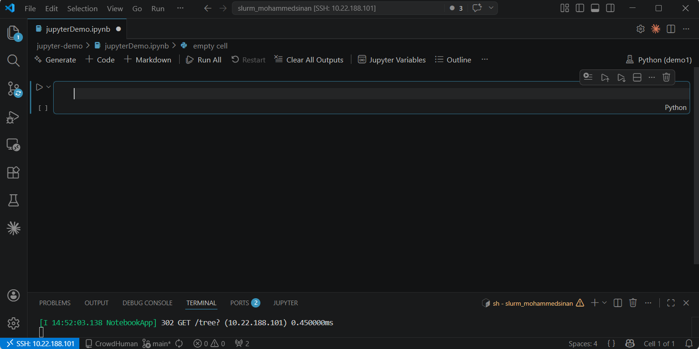

# How to Run Jupyter Notebook on SLURM

This guide explains how to run Jupyter Notebook on the SLURM cluster using two different methods.

=== "Direct on SLURM"

    1.  **Access the cluster** — connect to the SLURM login node via SSH.

        

    2.  **Check available resources**

        ```bash
        sinfo
        ```

        

    3.  **Request a compute node**

        ```bash
        salloc -p interactive --gres=gpu:1 --cpus-per-task=8 --mem=32G
        ```

        Optionally specify a node (e.g. `jrcai01`) if required and available. Wait until the job is allocated — you'll be automatically placed on the compute node.

        

    4.  **Start Jupyter Notebook/Lab**

        !!! note

            `jupyter-start` is enabled by the line `cluster_env jupyter` in your `~/.bashrc` (on by default) — see [Shell Settings](environment/shell-settings.md). If you get "command not found", check that line isn't commented out.

        ```bash
        jupyter-start
        ```

        Wait for initialization. Once ready, a URL with a token will be printed in the terminal.

        

    5.  **Access Jupyter** — open the generated URL in your browser.

        

    6.  **Logout**

        | Action | Shortcut |
        |--------|----------|
        | Suspend the process | ++ctrl+z++ |
        | Logging out | Close the SSH session |

=== "Via VS Code"

    1.  **Connect to the cluster** — connect to the SLURM login node via SSH.

        

    2.  **Request a compute node**

        ```bash
        salloc -p interactive --gres=gpu:1 --cpus-per-task=8 --mem=32G
        ```

        Optionally specify a node (e.g. `jrcai01`) if required and available. Wait until the job is allocated — you'll be automatically placed on the compute node.

        

    3.  **Prepare your working directory**

        ```bash
        mkdir <project_dir>
        cd <project_dir>
        ```

    4.  **Activate your environment**

        === "Conda"

            ```bash
            conda activate <env_name>
            ```

        === "Python venv"

            ```bash
            source venv/bin/activate
            ```

        A successful activation is indicated by `(venv)` appearing in the terminal prompt.

        

    5.  **Start Jupyter (no-browser mode)**

        ```bash
        jupyter notebook --no-browser --port=<PORT> --ip=0.0.0.0
        ```

        Choose a port in the ephemeral range **49152–49999**. The terminal prints a token-based URL — copy it for the next step.

        

    6.  **Connect from VS Code**

        1. Open VS Code
        2. Open your `.ipynb` file
        3. Click **Select Kernel** (top-right corner)
        4. Choose **Existing Jupyter Server**
        5. Paste the token URL generated in the previous step
        6. Select kernel

    7.  **Access Jupyter** — the connection to the remote Jupyter server is established, and you can run and edit notebooks directly in VS Code.

        

## Useful Diagnostic Commands

Run these inside a notebook cell to verify your environment:

```python
!hostname      # shows the current compute node you are running on
!which python  # shows the active Python environment
!nvidia-smi    # shows the GPU(s) allocated to your session
```
