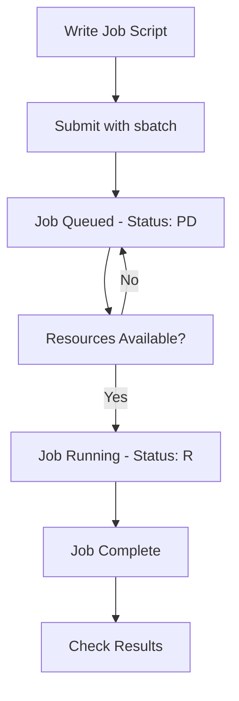

# 🖥️ SLURM Guide - KFUPM JRCAI

**Simple Linux Utility for Resource Management**

Slurm is a workload manager designed for clusters. It efficiently schedules jobs and manages resources, ensuring fair and effective utilization of computational power.


## 📋 Table of Contents

- [Monitoring SLURM](#monitoring-slurm)
- [Utilizing SLURM](#submitting-jobs)
- [Transferring Data](#transferring-data)
- [Account Commands](#account-commands)


###  Quick Reference Card

| **Category** | **Command** | **Purpose** |
|--------------|-------------|-------------|
| **Monitoring** | `sinfo` | Cluster status |
| | `scontrol show job ID` | Job details |
| | `squeue -u $USER` | Your jobs |
| **Utilizing** | `sbatch script.sh` | Submit batch job |
| | `salloc --cpus-per-task=4` | Interactive allocation |
| | `srun python script.py` | Execute command |
| **Transferring** | `scp file.txt user@host:~/` | Upload file |
| | `sftp user@host` | Interactive transfer |
| **Account** | `spasswd` | Change password |
| | `sacct` | Job history |


---

<details>
<summary>🔍 Monitoring SLURM</summary>

## Monitoring SLURM

Commands for checking cluster status, job information, and resource availability.

###  sinfo - Cluster Information
View cluster node information and partition status:

```bash
# Basic cluster info
sinfo

# Detailed node view
sinfo -N

# Partition summary
sinfo -s

# Node-specific details
sinfo -N -l
```

**Common Output:**
```
PARTITION AVAIL  TIMELIMIT  NODES  STATE NODELIST
debug*       up   infinite      2   idle node[01-02]
gpu          up   infinite      1   idle gpu01
```

###  scontrol - Detailed Control Information
Show detailed parameters of jobs, nodes, and partitions:

```bash
# Show specific job details
scontrol show job 115

# Show node information
scontrol show node

# Show partition details
scontrol show partition XXXXX

# Show all job information
scontrol show jobs

# View all available partitions
scontrol show partitions

# Check node specifications
scontrol show nodes
```

**Example Job Details:**
```
JobId=115 JobName=my_job
   UserId=mohammed_slurm(1001) GroupId=users(100) MCS_label=N/A
   Priority=4294901758 Nice=0 Account=(null) QOS=normal
   JobState=RUNNING Reason=None Dependency=(null)
   Requeue=1 Restarts=0 BatchFlag=1 Reboot=0 ExitCode=0:0
   RunTime=00:05:42 TimeLimit=01:00:00 TimeMin=N/A
   SubmitTime=2025-10-08T10:30:15 EligibleTime=2025-10-08T10:30:15
   StartTime=2025-10-08T10:30:17 EndTime=2025-10-08T11:30:17 Deadline=N/A
   WorkDir=/home/mohammed_slurm
   StdOut=/home/mohammed_slurm/output_115.txt
   StdErr=/home/mohammed_slurm/error_115.txt
```

###  squeue - Job Queue Status
Query the status of jobs in the queue:

```bash
# View all jobs
squeue

# View only your jobs
squeue -u username

# View specific job
squeue -j 115

# View jobs by name
squeue --name=my_job

# Detailed format
squeue -o "%.10i %.20j %.10P %.10a %.8C %.30b %.10M %.10m %.10R"
```

**Job States:**
- **R**: Running
- **PD**: Pending
- **CG**: Completing
- **CD**: Completed
- **CA**: Cancelled
- **F**: Failed

**Example Output:**
```
JOBID PARTITION     NAME     USER ST       TIME  NODES NODELIST(REASON)
  115     debug  my_job mohammed  R       5:42      1 node01
  116     debug test_job mohammed PD       0:00      1 (Resources)
```

</details>

---

<details>
<summary>⚡ Utilizing SLURM</summary>

## Submitting Jobs 

Commands for submitting and running jobs on the cluster.

###  sbatch - Submit Batch Jobs
Submit job scripts to the SLURM scheduler:

```bash
# Basic job submission
sbatch my_script.slurm

# Submit with additional options
sbatch --partition=gpu --gres=gpu:1 my_script.slurm
```


###  salloc - Interactive Resource Allocation
Allocate compute resources for interactive use:

```bash
# Basic interactive allocation
salloc

# Specify resources
salloc --cpus-per-task=10 --mem=20G --gres=gpu:1

# Interactive session with time limit
salloc --time=02:00:00 --partition=XXXXX

# Request specific nodes
salloc --nodelist=node01,node02
```

**Example Session:**
```bash
$ salloc --cpus-per-task=4 --mem=8G
salloc: Granted job allocation 109
$ # You now have resources allocated
$ exit  # Release the allocation
salloc: Relinquishing job allocation 109
```

###  srun - Execute Commands
Launch applications on allocated compute resources:

```bash
# Run command directly (allocates resources automatically)
srun python my_script.py

# Run with specific resources
srun --cpus-per-task=4 --mem=8G python my_script.py

# Run interactively after salloc
salloc --cpus-per-task=4 --mem=8G
srun python interactive_script.py


```


**Job Control Commands:**
```bash
# Cancel a job
scancel 115

# Cancel all your jobs
scancel -u username

# Hold a job
scontrol hold 115

# Release a held job
scontrol release 115
```

</details>

---

<details>
<summary>📁 Transferring Data</summary>

## Transferring Data

Commands for moving files between your local machine and the cluster.

###  scp - Secure Copy Protocol
Transfer files and directories securely:

#### **Upload to Cluster**
```bash
# Upload a single file
scp file.txt username@10.22.188.36:~/

# Upload a directory
scp -r /local/directory username@10.22.188.36:~/destination/

# Upload with specific destination
scp -r /Downloads/my-project mohammed_slurm@10.22.188.36:~/data/

# Upload to specific path
scp dataset.csv mohammed_slurm@10.22.188.36:/home/mohammed_slurm/projects/
```

#### **Download from Cluster**
```bash
# Download a file
scp username@10.22.188.36:~/results.txt ./

# Download a directory
scp -r username@10.22.188.36:~/output/ ./local-results/

# Download with specific source
scp mohammed_slurm@10.22.188.36:~/data/processed_data.csv ./
```


### 📋 sftp - Secure File Transfer Protocol
Interactive file transfer with more features:

```bash
# Connect to cluster
sftp username@10.22.188.36

# SFTP commands once connected:
sftp> pwd                    # Show remote directory
sftp> lpwd                   # Show local directory
sftp> ls                     # List remote files
sftp> lls                    # List local files
sftp> cd remote-directory    # Change remote directory
sftp> lcd local-directory    # Change local directory

# Transfer files
sftp> put local-file.txt     # Upload file
sftp> get remote-file.txt    # Download file
sftp> put -r local-dir/      # Upload directory
sftp> get -r remote-dir/     # Download directory

# Exit
sftp> quit
```

#### **Useful SFTP Commands**
```bash
# Create remote directory
sftp> mkdir new-directory

# Remove remote file
sftp> rm unwanted-file.txt

# Remove remote directory
sftp> rmdir empty-directory

# Show file permissions
sftp> ls -la

# Change permissions
sftp> chmod 755 script.sh
```

### 📝 Tips for Data Transfer

#### **Before Transferring:**
```bash
# Create directories on cluster
ssh username@10.22.188.36
mkdir ~/data ~/results ~/scripts
exit
```

#### **Efficient Transfer:**
```bash
# Compress before transfer (large datasets)
tar -czf project.tar.gz project/
scp project.tar.gz username@10.22.188.36:~/
ssh username@10.22.188.36 "cd ~ && tar -xzf project.tar.gz"

# Transfer with progress
scp -v file.txt username@10.22.188.36:~/  # Verbose mode
```

#### **Common Issues:**
- **Permission denied**: Check your username and password
- **Host key verification**: Accept the host key on first connection
- **Large files**: Consider using `rsync` for better performance
- **Windows users**: Use full paths, not `~/`

</details>

---

<details>
<summary> Account Commands</summary>

## Account Commands

Commands for managing your SLURM cluster account and authentication.

###  spasswd - Change SLURM Password
**Important**: The standard `passwd` command does not work for SLURM users. Always use `spasswd`:

```bash
# Change your SLURM password
spasswd
```
###  Account Management Tips

#### **Password Best Practices:**
- Use `spasswd` immediately after receiving account credentials
- Choose a strong password (8+ characters, mixed case, numbers, symbols)
- Never share your SLURM credentials


###  Account Information Commands

#### **View Your Account Details**
```bash
# Show your user information
sacctmgr show user $USER

# Show association details
sacctmgr show associations user=$USER

# View account limits
sacctmgr show account

# Check your usage
sreport user top start=2025-01-01 end=now
```

#### **Job History and Accounting**
```bash
# View job history
sacct

# View specific job details
sacct -j 12345 --format=JobID,JobName,State,ExitCode,Start,End

# View jobs from specific date
sacct --starttime=2025-10-01

# View detailed resource usage
sacct -j 12345 --format=JobID,MaxRSS,MaxVMSize,AveCPU,AveRSS
```

#### **Check Resource Usage**
```bash
# Current resource usage
sstat -j 12345 --format=AveCPU,AveRSS,MaxRSS

# Monitor running job
watch sstat -j 12345 --format=AveCPU,AveRSS,MaxRSS

# View cluster usage
sshare -u $USER
```


</details>


---

## 📋 Essential SLURM Workflow


---

###  Getting Help

#### **Contact Information:**
- **System Administrator**: Contact JRCAI support team
- **Technical Issues**: mohammed.sinan@kfupm.edu.sa
- **Account Problems**: Submit ticket through proper channels
*Last Updated: 16/9/2025*  
*By: Mohammed AlSinan (mohammed.sinan@kfupm.edu.sa)*

**Login Node**: 10.22.188.36 (may vary - check your registration details)
