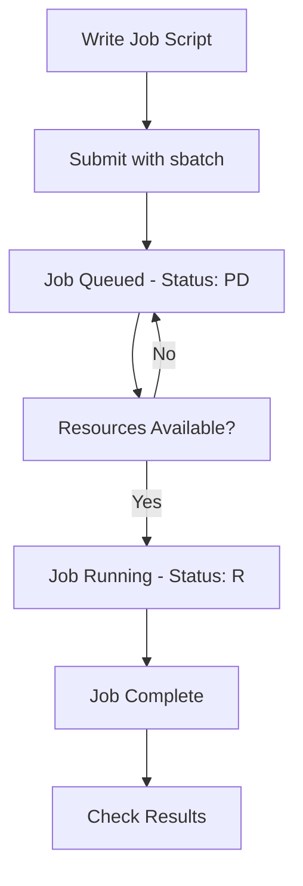

# SLURM Guide 🚀

A comprehensive guide to using SLURM (Simple Linux Utility for Resource Management) for high-performance computing clusters.

## 📋 Table of Contents

- [Getting Started](docs/getting-started.md)
- [Commands Reference](docs/commands/)
  - [Fundamental Commands](docs/commands/fundamental-commands.md)
  - [Job Management](docs/commands/job-management.md)
  - [Advanced Commands](docs/commands/advanced-commands.md)
- [Examples](docs/examples/)
  - [Batch Scripts](docs/examples/batch-scripts/)
  - [Interactive Sessions](docs/examples/interactive/jupyter-setup.md)
- [Data Transfer](docs/data-transfer/scp-guide.md)
- [Sample Scripts](scripts/)

## 🎯 Quick Start

1. **Change your password** (required for SLURM users):
   ```bash
   spasswd
   ```

2. **Submit a job**:
   ```bash
   sbatch my_job_script.sh
   ```

3. **Check job status**:
   ```bash
   squeue -u $USER
   ```

4. **Cancel a job**:
   ```bash
   scancel <job_id>
   ```

## 📖 What is SLURM?

SLURM is a workload manager designed for clusters that:
- ✅ Efficiently schedules jobs
- ✅ Manages computational resources
- ✅ Ensures fair resource utilization
- ✅ Supports both batch and interactive jobs

## 🏗️ Basic Workflow



## 📚 Documentation Structure

- **Getting Started**: Basic concepts and setup
- **Commands**: Detailed command reference with examples
- **Examples**: Ready-to-use scripts and configurations
- **Data Transfer**: Moving files to/from the cluster

## 🤝 Contributing

Contributions are welcome! Please see our [contributing guidelines](CONTRIBUTING.md) for details.

## 📝 License

This documentation is available under the MIT License. See [LICENSE](LICENSE) for details.

---

**Need help?** Open an [issue](../../issues) or check our [FAQ](docs/faq.md).